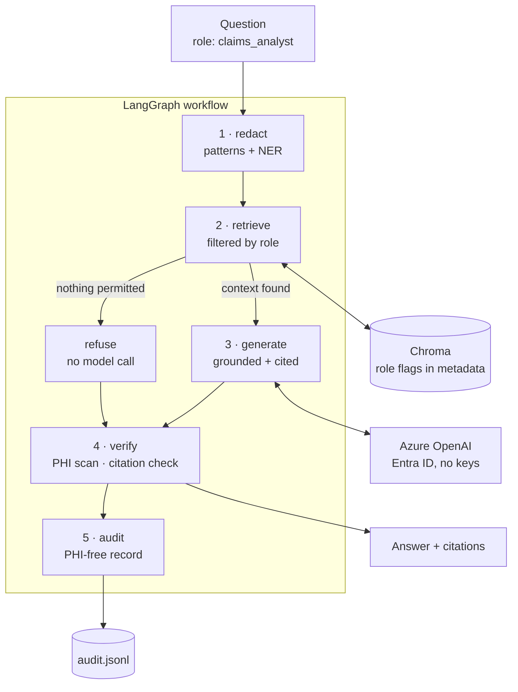

# Secure Clinical RAG

A retrieval-augmented question answering service over health plan policy, built
with **LangChain** and **LangGraph** on **Azure OpenAI**, designed the way a
covered entity would need it: PHI stripped before inference, retrieval filtered
by the caller's role, every answer cited, every request auditable.

> **All policy documents in this repository are synthetic.** They were invented
> for this demo. Nothing here is real coverage policy, clinical guidance, or
> medical advice.

---

## Why this exists

Most RAG demos answer questions. In healthcare, answering is the easy part. The
hard parts are: not sending patient identifiers to a model, not showing a
claims analyst a restricted behavioral health policy, not inventing a citation,
and being able to prove all three afterwards.

This project treats those as engineering requirements rather than prompt
instructions.

---

## Architecture



**The five stages**

| Stage | What it does | Control it enforces |
|---|---|---|
| `redact` | Regex patterns for structured IDs, Presidio NER for names and places | No PHI leaves the process |
| `retrieve` | Chroma search filtered by `role_*` metadata flags | Least privilege, deny by default |
| `generate` | Answers only from retrieved context; must emit `INSUFFICIENT_CONTEXT` otherwise | Grounding |
| `verify` | Rejects citations to documents that weren't retrieved; scans output for identifiers | No fabricated sources, no leaks |
| `audit` | One JSON line per request: who, role, documents, PHI types, refusal, hashes | Provable access history |

---

## Security model

| Decision | Implementation | Alternative rejected |
|---|---|---|
| No API keys | Entra ID tokens via `DefaultAzureCredential`; `disableLocalAuth=true` on the resource | Key in `.env` — a long-lived secret one commit away from a repo |
| Access control in data | One boolean per role on every chunk; filter runs inside Chroma | Prompt instruction ("don't reveal restricted policy") — a suggestion, not a control |
| Deny by default | Unknown role raises; no fallback to "public only" | Silent default — fails open, invisibly |
| Verify retrieval output | Returned chunks re-checked against the caller's role | Trusting the store's filter unconditionally |
| Audit without PHI | Salted hash of the question, plus the redacted text and entity counts | Logging raw questions — a second PHI store with weaker controls |
| Refuse without inference | No permitted documents means no model call at all | Calling the model and hoping it declines |

**Roles**

| Role | Sees |
|---|---|
| `member_services` | Member-facing material only |
| `claims_analyst` | Payer policy, not restricted clinical policy |
| `clinician` | Clinical guidance and restricted policy |
| `compliance_auditor` | Everything, read-only |

`POL-BEH-002` (outpatient behavioral health) is restricted to `clinician` and
`compliance_auditor`. Asking about it as a claims analyst returns nothing — the
content never enters the context window.

---

## Quickstart

Requires Python 3.12 and an Azure subscription. Every `make` target runs
`.venv/bin/python`, so the virtualenv never needs activating.

```bash
python3.12 -m venv .venv
make install                 # dependencies + the spaCy model
cp .env.example .env         # then set AZURE_OPENAI_BASE_URL
az login                     # how the app gets its token
make check                   # verifies config and model access
make ingest                  # build the index
make demo                    # the full walkthrough
```

Nothing above needs an API key, because the resource doesn't have key
authentication enabled.

### Offline mode

Every part of the system runs without Azure, using a deterministic mock model
and hash-based embeddings:

```bash
make ingest-mock
make ask-mock ROLE=clinician Q="What is the CPAP adherence requirement?"
make test
```

---

## Azure setup

One Foundry resource, two deployments, keyless auth:

| Item | Value used here |
|---|---|
| Resource | Foundry (`Microsoft.CognitiveServices`), East US 2 |
| Chat deployment | `chat` → `gpt-5.4-mini` |
| Embeddings deployment | `embeddings` → `text-embedding-3-small` |
| Auth | Entra ID, role `Cognitive Services OpenAI User` |
| Keys | Disabled (`disableLocalAuth=true`) |
| Endpoint | `https://<resource>.services.ai.azure.com/openai/v1/` |

Deployments are named by role rather than by model, so a model swap when
`gpt-5.4-mini` retires is a portal change, not a code change.

```bash
# assign yourself the data-plane role (Owner does not grant inference access)
az role assignment create --assignee <you> \
  --role "Cognitive Services OpenAI User" \
  --scope /subscriptions/<sub>/resourceGroups/<rg>/providers/Microsoft.CognitiveServices/accounts/<resource>

# turn off key authentication
az resource update -g <rg> -n <resource> \
  --resource-type "Microsoft.CognitiveServices/accounts" \
  --set properties.disableLocalAuth=true
```

---

## Testing

```bash
make test        # 30 unit tests, offline, ~2 seconds
make eval-mock   # retrieval and access checks, offline
make eval        # adds grounding, citation and refusal checks against Azure
```

The split matters. **Tests** cover what must never vary — access control, PHI
handling, citation verification, audit contents — and run on the mock provider,
so CI needs no credentials and costs nothing. **Evals** (`evals/cases.yaml`)
measure what can vary: does the answer contain the right threshold, cite the
right policy, refuse when it should.

`make eval` exits non-zero on failure, so it can gate a deployment.

---

## Repository layout

```
src/clinical_rag/
  config.py       typed settings, fails loudly on bad configuration
  llm.py          Azure (Entra ID) and offline mock model clients
  access.py       roles, and the metadata flags that enforce them
  corpus.py       markdown + frontmatter -> chunked documents
  vectorstore.py  Chroma index, one per provider
  retrieval.py    Principal, role-filtered search, result verification
  phi.py          two-layer PHI redaction and output scanning
  graph.py        the LangGraph workflow
  audit.py        PHI-free audit records
scripts/          check_setup, ingest, ask, phi_demo, access_demo,
                  audit_review, evaluate
data/corpus/      six synthetic policy documents
tests/            30 tests, offline
evals/cases.yaml  eight evaluation cases
```

---

## Known limitations

- **Single-role principals.** Real staff hold multiple entitlements; this maps
  one role per caller. Extending to a set of roles means an `$or` filter over
  role flags.
- **Chunk-level access only.** Access is uniform within a document. A document
  with mixed sensitivity would need section-level flags.
- **PHI detection is not perfect.** Presidio is statistical; unusual names and
  novel identifier formats will be missed. The output scan is a second net, not
  a guarantee.
- **Public endpoint.** The resource accepts traffic from any network, for local
  development. Production would use Private Endpoints and no public access.
- **No re-ranking.** Retrieval is plain vector similarity. A cross-encoder
  re-ranker would improve precision on larger corpora.
